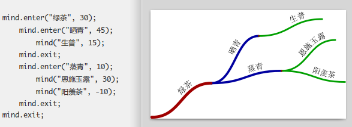

# mindmap

mindmap 是一个 MetaPost（确切而言是 MetaFun）模块，用于绘制思维导图。

mindmap is a MetaPost (specifically MetaFun) module for drawing mind maps.



## 安装 / Installation

假设你已经按照 「[ConTeXt wiki 上的安装指南](https://wiki.contextgarden.net/Introduction/Installation)」安装了 ConTeXt lmtx，且假设安装于 $HOME/opt/context，那么安装 mindmap 模块的过程是

Assume you have installed ConTeXt LMTX according to the "https://wiki.contextgarden.net/Introduction/Installation". If the installation path is `$HOME/opt/context`, follow these steps to install the mindmap module:

```console
$ CTXTHIRD=$HOME/opt/context/tex/texmf-local/tex/context/third
$ mkdir -p $CTXTHIRD
$ cp t-mindmap.mkxl $CTXTHIRD
$ context --generate
```

# 示例 / Examples

以 demo 目录中的 foo-01.tex 为例，使用 context 命令编译该文件：

To compile the sample file `foo-01.tex` located in the `demo` directory, use the context command:

```console
$ context foo-01.tex
```

结果在同一目录下可得 foo-01.pdf 文件，而该文件中的图形即为思维导图。

The resulting PDF file foo-01.pdf will be generated in the same directory, containing a rendered mind map.
