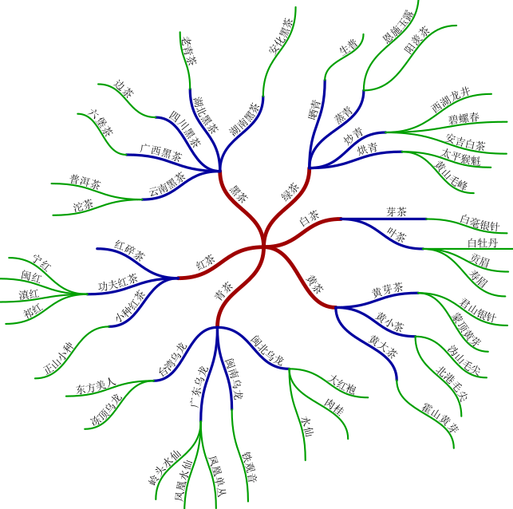

# mindmap

mindmap is a MetaPost (specifically MetaFun) module for drawing mind maps.



Assume you have installed ConTeXt LMTX according to the "https://wiki.contextgarden.net/Introduction/Installation". If the installation path is `$HOME/opt/context`, follow these steps to install the mindmap module:

```console
$ CTXTHIRD=$HOME/opt/context/tex/texmf-local/tex/context/third
$ mkdir -p $CTXTHIRD/mindmap
$ cp t-mindmap.mkxl $CTXTHIRD/mindmap
$ context --generate
```

An English guide mindmap.pdf is available in `doc` directory. 

There also is a Chinese guide at https://zhuanlan.zhihu.com/p/1937182854619570456
